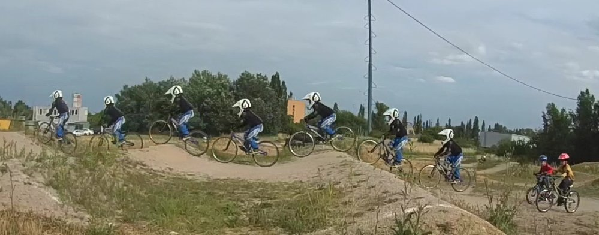
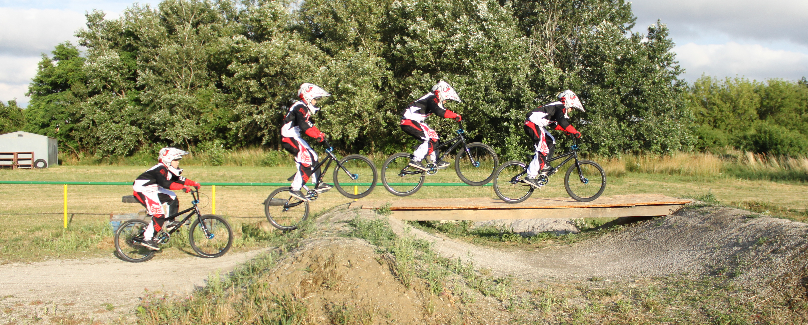
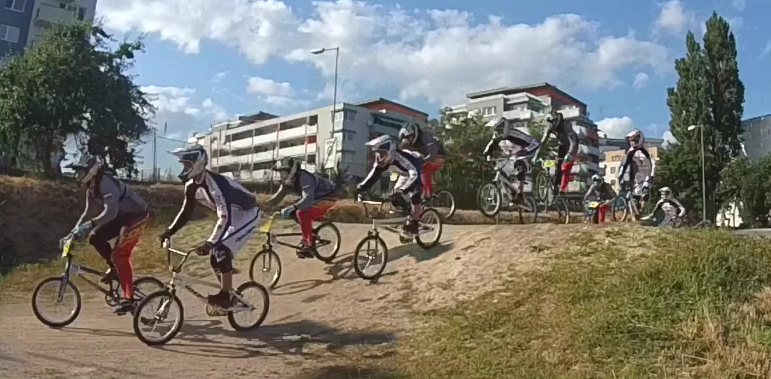

Využitie foto a video techniky v tréningu cyklistiky (BMX)
==========================================================

 Cieľom práce je predstaviť niektoré postupy záznamu a analýzy športovej sekvencie
 a možné využitie týchto techník pri tréningu (najmä techniky) v BMX.

 V práci sú uvedené základne techniky snímania, spracovania, 
 a naznačené možné analýzy a možného využitia jednotlivých techník.

 Niektoré techniky sú známe z iných odvetví (kolektívne športy),
 ale pomerne málo alebo len čiastočne využívané v bežnom cyklistickom tréningu.

 Z dostupnosťou moderných technológií v mobilných zariadeniach
 sa však mnohé z nich stávajú cenovo dostupné a realizovateľné 
 aj v bežných individuálnych a klubových tréningoch.

Ide najme o techniky:

- foto sekvencie (Action Sequence Photo)
- spomalený video záznam
- anotovaný video záznam
- porovnávací video záznam alebo foto sekvencie

## Foto sekvencie (AS, Akčná sekvencia, sekvencia akcie, Action Sequence Photo)

Príklady:

Často využívaná technika v metodických materiáloch,
využíva sa tak kde video záznam nie je použiteľný (tlač),
alebo menej výpovedný ako fotografický záznam.

Umožňuje dodatočné anotovanie obrázkov a vyznačenie kľúčových aspektov techniky ako
trajektória pohybu, poloha tela a bicykla alebo aj časové aspekty (timing) ako miesto 
želaného odrazu, dopadu vzhľadom na prekážku.

Využitie:

V bežnej praxi sa stretneme skôr z využitím existujúcich sekvencií z 
externých zdrojov a ich následného využitia v tréningu na vysvetľovanie správnej techniky.
Anotovanie priamo pri vysvetľovaní témy môže byť veľmi efektívnym nástrojom, 
dopredu staticky anotované obrázky majú spravidla nižší efekt. Tu môže tréner 
využiť napríklad dostupný SW (MS Power Point, animácie) a postupne na obrázku zobrazovať
jednotlivé anotácie počas vysvetľovania, 
alebo úplne jednoducho priamo na papieri dokresľovať do obrázka
farebné značky.

Okrem tohoto metodického použitia sa veľmi často používa akčná sekvencia 
ako reklamný propagačný nástroj.

Realizácia:

Z foto alebo video záznamu.
V prípade foto záznamu, sa nemusí podariť (pri bežných fotoaparátoch) zachytiť vhodné polohy,
ale kvalita fotografií (ostrosť) je spravidla lepšia, v prípade vide záznamu je nutné z neho najskôr extrahovať fotografie, 
čo zase vyžaduje SW a skúsenosti. Oba procesy potom pokračujú výberom vhodných fotografií 
dobre reprezentujúcich danú techniku a ich spojení do jedného obrázka.
Tu ide spravidla o manuálny proces vyžadujúci znalosť práce z daným grafickým SW a značnú prax.
Úplná a použiteľná automatizácia takéhoto procesu nie je podľa mne dostupných informácií 
v súčasnosti dostupná v bežných SW nástrojoch.

Nasledujúce fotografie boli vytvorené z vide záznamu, každá samostatne

Na príklade je vidno, že zostaviť sekvenciu vhodnú na porovnanie, oboch jazdcov by vyžadovalo
ešte ďalšie úsilie a použitie tých istých obrázkov. V prípade video záznamu je to realizovateľné,
treba sekvenciu zostavovať na mieru na porovnávanie a vybrať rovnaké, signifikantné okamihy. 
 
V prípade fotografií a sekvencií pre porovnávanie je to už ťažšie. Vzhľadom na rozdielnu rýchlosť
pohybu jazdcov a možnosti fotoaparátu (počet snímkov za sekundu) sa 
sa šanca nasnímať identické okamihy ešte zhoršuje:

Sekvenčná fotografia dvoch jazdcov (súčasne jazdiacich), predstavuje najzložitejšiu
realizáciu a jej efekt pre porovnanie je tiež diskutabilný. Ide síce o efektný obrázok,
ale z pomerne sporným metodickým významom:

Výhody:

- použiteľný v tlači
- minimálne nároky na prezentáciu (vytlačené na papieri)
- nenáročný spôsob dodatočnej anotácie (dokonca aj online na mobilnom zariadení)

Nevýhody:

- náročná realizácia (nie úplne automatický proces, treba grafický SW a skúsenosti)
- statický pohľad, chýbajúca dynamika pohybu

## Spomalený video záznam

## Anotovaný (komentovaný video záznam)

## Porovnávací video záznam

## Sumarizácia
Nasledovná tabuľka porovnáva vhodnosť jednotlivých techník a ich náročnosť na
realizáciu a demonštrácie na rôzne účely:

TODO:

## Použitá technika

- Canon EOS 500D + bežný objektív
- iSaw 3 Extreme - kamera
- iPhone 6
- iPad 3
- 

## Literatúra

- ]<http://www.leelikesbikes.com/book-pro-bmx-skills>
- <https://github.com/ainthek/video-tools>
- TODO: linka na ASequence bakalarky čo som našiel

