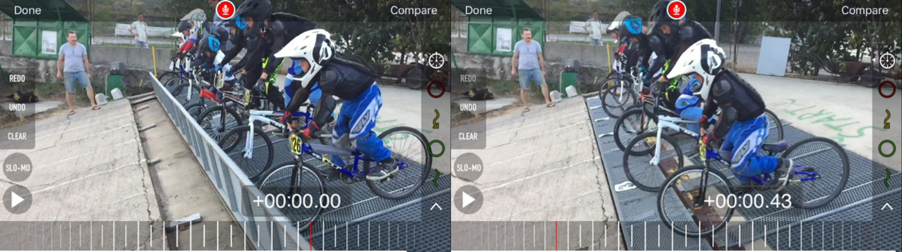

cat << 'EOF'

Využitie foto a video techniky v tréningu cyklistiky (BMX)
==========================================================

Cieľom práce je predstaviť niektoré postupy záznamu a analýzy športovej sekvencie
a možné využitie týchto techník pri tréningu (najmä techniky) v BMX.

V práci sú uvedené základne techniky snímania, spracovania, 
a naznačené možné analýzy a možného využitia jednotlivých techník.

Niektoré techniky sú známe z iných odvetví (kolektívne športy),
ale pomerne málo alebo len čiastočne využívané v bežnom cyklistickom tréningu.

Z dostupnosťou moderných technológií v mobilných zariadeniach
sa však mnohé z nich stávajú cenovo dostupné a realizovateľné 
aj v bežných individuálnych a klubových tréningoch, 
bez nutnosti profesionálnych fotografických, kameramanských alebo strihačských znalostí.

V tejto práci sa zaoberáme najmä technikami:

- foto sekvencia (Action Sequence Photo)
- spomalený video záznam
- porovnávací video záznam alebo porovnávacia foto sekvencia
- anotovaný video záznam
- analýza videa (manuálna, semi automatická, automatická)

V jednotlivých kapitolách sú uvedené jednotlivé techniky, 
ich možné využitia, spôsob realizácie, výhody a nevýhody danej techniky.

## Foto sekvencie (Action Sequence Photo, Akčná sekvencia, sekvencia akcie, AS)

Tradičná a často využívaná technika v metodických materiáloch [1], 
Využíva sa tam, 
kde video záznam nie je použiteľný (knižná tlač, metodické články v časopisoch)
alebo je menej výpovedný ako fotografický záznam.

Príklady:

### Využitie

V bežnej praxi sa stretneme skôr z využitím existujúcich sekvencií z 
externých zdrojov [1] a ich následného využitia v tréningu na vysvetľovanie správnej techniky.

Akčná sekvencia, umožňuje okrem zobrazenia rozfázovaného pohybu aj 
dodatočné anotovanie obrázkov a vyznačenie kľúčových aspektov techniky ako
trajektória, poloha tela a bicykla alebo aj časové aspekty (timing) ako miesto 
ideálneho odrazu/dopadu vzhľadom na prekážku.

Anotovanie priamo pri vysvetľovaní témy môže byť veľmi efektívnym nástrojom, 
dopredu staticky anotované obrázky majú spravidla nižší efekt. 

Tu môže tréner využiť napríklad dostupný SW (MS Power Point a efekty animácie) 
a postupne na obrázku zobrazovať
jednotlivé anotácie počas vysvetľovania, 
alebo úplne jednoducho priamo na papieri dokresľovať do obrázka
farebné značky.

Okrem tohoto metodického použitia sa veľmi často používa akčná sekvencia 
ako reklamný propagačný nástroj.

### Využitie: Porovnávacie video sekvencie

Nasledujúce fotografie boli vytvorené z video záznamu:

Na príklade je vidno, že zostaviť sekvenciu vhodnú na porovnanie, oboch jazdcov by vyžadovalo
ešte ďalšie úsilie a použitie tých istých obrázkov. V prípade video záznamu je to realizovateľné,
treba sekvenciu zostavovať na mieru na porovnávanie a vybrať rovnaké, signifikantné okamihy. 
 
V prípade fotografií a sekvencií pre porovnávanie je to už ťažšie. Vzhľadom na rozdielnu rýchlosť
pohybu jazdcov a možnosti fotoaparátu (počet snímkov za sekundu) sa 
sa šanca nasnímať identické okamihy ešte zhoršuje:

Sekvenčná fotografia dvoch jazdcov (súčasne jazdiacich), predstavuje najzložitejšiu
realizáciu a jej efekt pre porovnanie je diskutabilný. Ide síce o efektný obrázok,
ale z pomerne sporným metodickým významom:

## Využitie: Zobrazenie trajektórie pohybu 

Pomerne použiteľné je zobrazenie trajektórie jazdca v zatáčke, 
ale aj tu videozáznam viacerých jazdcov je výstižnejší (kapitola Porovnávací video záznam).

### Realizácia, vytváranie vlastných foto sekvencií

Sekvenciu je možné vytvoriť v zásade z dvoch zdrojov: z fotografií alebo z videa.

V prípade fotografií, sa nemusí podariť (pri bežných fotoaparátoch) zachytiť vhodné polohy,
ale kvalita fotografií (ostrosť) je spravidla lepšia, 
v prípade video záznamu je nutné z neho najskôr extrahovať fotografie, 
čo zase vyžaduje SW a skúsenosti. 

Postupov je niekoľko od automatických [7], 
cez rôzne polo automatické, až po manuálne postupy. Každý z nich využíva SW a sú
nutné nejaké základné znalosti z jeho ovládaním. Pomocou moderných prehliadačov, už
je možné dnes realizovať tieto operácie aj priamo online na web-e [video-tools], bez nutnosti 
inštalácie špecializovaného SW [FFMpeg, GIMP, SlowMo] na počítač alebo mobil.

Kvalita statického obrázku z videa a rozlíšenie je spravidla nižšie ako pri fotografii, ale 
pre metodické účely spravidla postačuje.

Oba prístupy potom pokračujú výberom vhodných fotografií 
dobre reprezentujúcich danú techniku a ich spojení do jedného obrázka.

Tu ide spravidla o manuálny proces vyžadujúci znalosť práce z daným grafickým SW [GIMP, Photoshop] 
a krokov ako v danom SW fotografie pospájať. Na internete existuje množstvo postupov ale aj
programov a príklady sú uvedené v literatúre [3][4][5][6].

Existujú práce z oblasti počítačovej grafiky [2]  zaoberajúce sa automatizáciou celého procesu,
ale z ich uplatnením v praxi som sa nemal možnosť zoznámiť.

Príklad extrakcie z videa a následnej kompozície do jedného obrázka:

	ffmpeg -i resources/slow-mo/cadence.mp4 -vf fps=1/10 resources/action-sequence/cadence%03d.jpg
	montage -tile 5x2 resources/action-sequence/cadence0*.jpg resources/action-sequence/cadence.jpg

Tento postup bol použitý na vytvorenie obrázka v kapitole o analýze kadencie.	

### Výhody:

- použiteľné v tlači
- minimálne nároky na prezentáciu (vytlačené na papieri)
- nenáročný spôsob dodatočnej anotácie na papieri, počítači, online na mobilnom zariadení, 
premietnutý obraz na tabuli
- možnosti porovnávania dvoch jazdcov ich techniky

### Nevýhody:

- prácna a náročná realizácia 
- iba statický pohľad, chýbajúca dynamika pohybu

V prípade silnejšej automatizácie procesu a použitia vysoko rýchlostného videa 
s vysokým rozlíšením ide o takmer ideálny nástroj na tvorbu metodických tlačených materiálov.

## Spomalený video záznam

Športové (akčné) kamery [iSaw 3 Extreme] ale aj mnohé mobilné zariadenia [iPhone6] podporujú nahrávanie videa v 
vysokých rozlíšeniach a vysokých počtoch snímkov za sekundu (120/240 fps). 

Toto umožňuje vytvárať kvalitné spomalené videozáznamy so spomalením až 6 krát bez straty kvality 
a dokonca aj 20 násobné spomalenia z dostatočnou kvalitou pre metodické účely. 

### Využitie:

Prehranie spomaleného videa a slovné vysvetlenie správnej prípadne, nesprávnej techniky. 
V prípade prehrávania s možnosťami ako spomalenie záznamu, zastavenie, zrýchlenie a 
v prípade možnosti ovládania cez diaľkový ovládač, ide o ideálny výukový materiál.

### Realizácia: natáčanie pre spomalené video 

V dnešnej dobe veľmi jednoduchá, postačuje mobilný telefón alebo akčná kamera.

Hlavnou výhodou moderných mobilných zariadení [iPhone6] je možnosť takto 
nasnímané video okamžite prehrať a zvoliť si spomalený výsek. 

Príklad použitia iPhone 6 a štandardného SW pre snímanie spomaleného videa (Slo-mo video, 120/240 fps)
a následného prehrania okamžite na telefóne jazdcovi.

Príklad spomalenia  odrazovej fázy a dopadovej fázy na štandardnom iPhone videu:

Takto jednoducho dokáže tréner jazdcovi na ukážke videa okamžite, 
hneď po vykonaní trénovanej techniky ukázať správne a chybné časti 
(v tomto prípade chybný dopad). Zároveň tak má jazdec má možnosť okamžitej 
vizuálnej spätnej väzby a nápravy pri ďalšom pokuse už na tom istom tréningu.

### Využitie: Stopky

Ďalším možným využitím spomaleného videa je meranie času, bez použitia špeciálnej techniky.
Príkladom môže byť meranie od pádu rampy po prechod predným kolesom cez meranú líniu.

Zaujímavé na tejto technike je, že ak meriame tú istú sekvenciu viacnásobne počas tréningu
dokážeme vyhodnotiť vplyv techniky a reakcie na signál na výsledný čas v prvom úseku. 
Teda meriame čas ale máme k nemu aj vysvetľujúce video. 
Všetko už počas tréningu bez potreby dodatočného spracovania videa na počítači a techniky pre meranie času.

Len pre zaujímavosť a porovnanie 0.43 sekúnd na štarte v podaní detí:

Presnosť takejto techniky je daná počtom snímkov za sekundu 
(bežných 30 fps ~= 0.4 s, 240 fps ~= 0.004 s), presným uhlom pohľadu a presnosti odčítania.

Toto samozrejme nenahrádza profesionálne meranie času, 
ale minimálne náklady a jej jednoduchosť je určite zaujímavá najmä na meranie veľmi krátkych úsekov.

### Využitie: Analýza štartu

Typickým podkladom v BMX, pre analýzu techniky je napríklad štart.
Nahrávanie štartov v spomalenej podobe, je vhodným príkladom vysvetlenia techniky [9]
a podkladom pre analýzu profesionálnym cauchom [10].

### Využitie: Počítanie kadencie, počtu záberov medzi prekážkami

V BMX je dôležité, okrem iného, maximálne využite priestoru medzi prekážkami na zrýchlenie, 
teda aktívne šliapanie do pedálov. Pomocou spomaleného videa je možné jazdcovi ukázať že:

začína šliapať príliš neskoro, 
spraví málo otáčok (kadencia), 
prípadne končí šliapanie príliš skoro pred prekážkou:

V praxi mu to ukazujeme na spomalenom zábere, tu ako ukážka fotografií:

 

Na príklade je jasné, že jazdec stihol len necelé 3 otáčky a začína šliapať neskoro za prvou prekážkou.
Iný jazdci v jeho kategórii robia medzi danými dvoma prekážkami 4-5 otáčok. 
Treba popracovať na zvýšení kadencie a začať šliapať skôr.

Na porovnanie 'tréningová hra' teda rátanie a snaha o zvyšovanie šliapania medzi prekážkami, 
je našťastie medzi deťmi obľúbená, 
takže použitie videa na tento účel je skôr analytické ako motivačné, jazdec dokáže počítať otáčky aj sám. 
Video môže maximálne pomôcť v identifikácii problému 
(nesprávne načasovanie, nízka kadencia, úplne nevhodné prevody, nedostatočná sila).

### Využitie: Analýza kadencie počas časovky 

Náhodný experiment z využitím kamery umiestnenej na zadnej konštrukcii bicykla, 
videozáznam z tréningovej časovky 6 ročného jazdca na domácej trati.

Originál video <https://www.youtube.com/watch?v=TG5ntk4okdg>, natočené pôvodne bez metodického úmyslu.

Video z označením časových intervalov (ukážka) <https://www.coachseye.com/v/ukNs>.

Následne z daného videa postupným manuálnym počítaním otáčok a označovaním intervalov, je pri znalosti trate možné zostaviť manuálne nasledovnú tabuľku (asi hodina práce).

Pri znalosti profilu trate a napárovaní  na profil trate je možné 
získať podstatne komplexnejšie údaje ako pri záberoch iba medzi dvoma prekážkami.

Analýza výsledkov:

Vybraný 6 ročný jazdec z 75 sekúnd na celej trati prešliape v pedáloch
2/3 času, čo je asi 50 sekúnd. Maximálna rpm ktorú dosiahne je 127, priemer je 95 rpm.

- pri štarte z rampy pomerne malé RPM (strach z prvej prekážky ?, problém statického štartu ?)
- nulová aktivita z prvej prekážky (z iných porovnaní jazdci dosiahnu 5-6 rotácií)
- maximálna frekvencia (prekvapivo 127 z prvej zátačky)
- iné

Bohužiaľ neexistuje porovnávacie video z iným jazdcom, ale
len na základe tohto videa už je možné identifikovať rozsah a aj priebeh typického zaťaženia, a možné tréningové zaťaženie na 
rozvoj rýchlosti napr. : 

Mimo trate:

- rýchlostný tréning na 1 minútu a meranie dosiahnutých rotácií 
- tréning 5 rotácií a 2 sekundy pauza a meranie výsledného času a vzdialenosti po 80 rotáciách.

Priamo na trati:

- zvýšenie počtu rotácií medzi prekážkami (pri zachovaní bezpečnej rýchlosti na zvládnutie ďalšej prekážky)
- iné

### Výhody

- voči cyklocomputer-u z počítaním kadencie, je možné veľmi presne korelovať na konkrétne miesto na trati
- ľahká montáž a minimálne náklady v prípade, že vlastníte 'action kameru' (GoPro Hero, iSaw, iné)
- Možnosť analýzy po tréningu, závodoch (ex-post) zo záznamu 

### Nevýhody

- nutnosť montáže/demontáže (10 min) na bicykel meranej osoby
- stiahnutie videa a prenos do SW z možnosťou merania času (10 min)
- vyhodnotenie (20-60 min podľa praxe a SW)
- drahé voči cyklocomputer-u z počítaním kadencie

### Vylepšenie a možná automatizácia postupu

- farebné značky na trati
- korelácia údajov z cyklocomputer-om merajúcim rýchlosť a prípadne GPS polohu
- použitie OpenCV (Computer Vision knižním a algortmov) na analýzu videa 
s identifikáciou kadencie a značiek na trati (v prípade farebných markerov 
a nálepiek na podrážkach obuvi projekt asi na týždeň práce)

## Anotovaný (komentovaný video záznam)

V praxi túto techniku najčastejšie poznáme z prestávok zápasov ľadového hokeja,
kedy hokejový znalec kreslí na obrazovke krúžky a šípky okolo hokejistov a puku a vysvetľuje, čo sa počas hry udialo
zle alebo dobre, kam smerovala prihrávka a kam ozaj mala smerovať, ktorý hráč stál kde a v akej dobrej zlej pozícii a podobne.

Zariadenie umožňujúce takéto zobrazenie sa nazýva Telestrátor.
Telestrator je zariadenie ktoré umožňuje operátorovi kresliť voľnou rukou ponad video alebo statické obrázky. 
<https://en.wikipedia.org/wiki/Telestrator>.

### Využitie

Bežne sa používa pre:

- kolektívne hry (hokej, futbal, americký futbal)
- individuálne športy (baseball, golf)
- atletiku, gymnastiku

V cyklistike a v BMX je jeho použitie menej známe.

### Realizácia 

V tradičnom ponímaní ide o zariadenie pomerne veľkého rozmeru a vysokej ceny, založené na klasickom PC a 
monitore (aj keď v prenosnom balení).

Našťastie rozvoj internet a mobilných technológií dnes sprístupňuje túto funkcionalitu na 
bežných mobilných telefónoch za minimálnu cenu, alebo na internetových stránkach ako online 
služby použiteľné z bežného PC a za podstatne nižšie ceny ako tradičné zariadenia.

Nahrávanie videa a následná okamžitá analýza na mobilnom zariadení:

Prehľad funkcionality:

Umožňuje z pôvodného videa vytvoriť nové video z rôznou rýchlosťou, zastavovaním, 
prevíjaním dopredu/dozadu,
zaznamenať k nemu hlasové komentáre 
a grafické, značky potom zobrazené v prehrávanom video zázname.

### Využitie: Analýza doskoku a vyznačenie nedokonalej techniky

Obrázok 1: vyznačenie miesta dopadu predného kolesa a problémová výška zadného kolesa.
Obrázok 2: Modrou označená dĺžka jazdy čisto po prednom kolese a farebne označený dopad predného a zadného kolesa.
Obrázok 3: To isté, ale s koncovou pozíciou jazdca

Samozrejme hlavnou prednosťou je, že anotovaním zase vznikne video,
kde jednotlivé značky pribúdajú odbúdajú tak ako to tréner vyznačil počas nahrávania,
prezentácia videa je však v texte tejto práce problémová, takže je uvedený len obrázok.

## Porovnávací video záznam

 Možnosť snímania video záznamov a ich porovnávanie je základom 
 diagnostiky techniky (napr. v atletických športoch), 
 alebo vhodnosti/nevhodnosti hernej stratégie (v kolektívnych hrách). 

 Samozrejme je možné ho použiť aj v cyklistickom (BMX) tréningu.

### Využitie: Porovnávanie jedného jazdca a jednej techniky tej istej prekážke

Nahrávanie jazdca počas nácviku danej techniky (prejazd po zadnom kolese, manual)
na tej istej prekážke môže poukazovať na nekonzistentné prevedenie. 
Napriek možným úspešným pokusom, ktoré jazdec vníma ako pozitívne zvládnutie techniky, 
videozáznam zachytí aj menej úspešné pokusy.
Príklad ukazuje dve nedokonalé prevedenia, rozdiely v náklone 
a neoptimálnom mieste dopadu predného kolesa.

Tréning by mal byť v takom prípade zameraný na konzistentnejšie zvládnutie, 
napr. 7 dokonalých prevedení z 10 na danej prekážke aby sa upevnili návyky a časovanie
a až potom pokračovať aplikovaním v inej rýchlosti a potom na inej prekážke.

Zároveň možno vysvetliť na jednotlivých úspešných záznamoch porovnaním z neúspešnými
kde bola chyba v polohe tela, načasovaní, vystretí nôh a rúk a podobne.

Takáto vizuálna spätná väzba môže urýchliť učenie, prípadne napomôcť motivácii.

Uchovanie záznamov zo správnym aj nesprávnym prevedením môže potom poslúžiť
ako dodatočný metodický materiál pre ďalšie tréningy, 
ale aj zaujímavý motivačný materiál: \"pozri ráno si to jazdil ešte takto, 
teraz je to oveľa lepšie, vidíš že sa to dokážeš naučiť za jeden deň, super \".

Príklady videí z konkrétneho tréningu:

<https://www.youtube.com/watch?v=Lp34ug6n9bM>
<https://www.youtube.com/watch?v=a9rVfpKtoV0>

Pred tréningom jazdci nedokázali prekonať danú prekážku po zadnom kolese.
Po každom druhom pokuse pozerali video a diskutovali sa chyby,
pokusy na prekážke boli striedané z prípravnými cvičeniami a pokusmi mimo prekážku.
Na konci hodinového tréningu už mali prevahu úspešných pokusov. 

### Využitie: Porovnávanie rôznych jazdcov a jednej techniky tej istej prekážke

Rovnako môžeme použiť porovnávanie dvoch jazdcov, poukázať na rozdiely v technike
a poskytnúť vizuálny návod na ich odstránenie. 
Teda častá otázka typu: "Prečo to jemu ide a mne nie ?"

<https://www.youtube.com/watch?v=DmGIgXQe_AE>

Rovnako ako v jednotlivých videách aj pri porovnávaniach je možné vkladať grafické prvky
zastavovať, spomaľovať video a podobne.

Ďalším druhom porovnávacieho videa je rovnako filmovanie viacerých jazdcov na jednej 
prekážke na trati ale bez špeciálnych úprav, napríklad prejazd zatáčkou je na takéto porovnanie
vhodný. Jazdci si môžu porovnať štýl jazdy, trajektórie, náklony, pedálovanie a rýchlosti prejazdu.
Toto je najjednoduchší spôsob nevyžadujúci nijaké špeciálne SW and HW vybavenie, postačuje kamera 
a prípadne prehrávač z možnosťou stop alebo spomaleného záznamu.

<https://www.youtube.com/watch?v=GLV-hCA7u64>

Iný príklad, "pumpovanie", rôznych jazdcov na tej istej prekážke>

<https://www.youtube.com/watch?v=y4yluIPQ4XQ>

### Realizácia

Podobne ako anotované video, je možné použiť SW v mobilných zariadeniach, prípadne
niektorý z video editačných nástrojov. 
Hlavnou výhodou špecializovaného mobilného SW, je možnosť zapnutia, vypnutia 
synchronizácie dvoch videí a samozrejme možnosť realizácie hneď počas tréningu.

### Výhody

- možnosť prezentácie v ľubovoľnom okamihu videa (čo sa v prípade akčnej fotografie nedá)
- možnosť synchronizácie v čase (čo v čase A robil jazdec 1 a 2)
napr. "neskoro priťahuješ riadidlá, pozri on už teraz krčil ruky"
- možnosť synchronizácie v priestore (v akej polohe bol jazdec 1 vs. jazdec 2 v bode A) - 
napr. "pozri, on ešte stále šliapal, a ešte aj tu šliapal a ty sa vezieš už dva metre"

## Kombinované a improvizované techniky

### Premietanie spomaleného videa na tabuľu a kreslenie anotácií fixkou
Takmer najvhodnejšia technika pre online analýzu konkrétneho výkonu, ale aj 
predvedenie správnej a nesprávnej techniky.

Video sa premieta na bielu  tabuľu a fixkou tréner vyznačuje dobré zlé techniky.
Postačuje projektor, počítač z prehrávačom videa a tabuľa (diaľkové ovládanie video prehrávača 
v počítači je výhodou).

### Fotografia z videa na telefóne a zaslanie jazdcovi, rodičovi

Menej ako minútová záležitosť. Najmä na demonštrovanie zlých techník.
Príklad, 7 ročný jazdec a mail rodičom: 
"Prosím pripomínajte mu správnu polohu na pedáloch aj pri bežnom jazdení po ulici,
pozrite ako má nesprávne nohy, stojí polovicou topánky mimo pedála".

Toto zároveň pomáha zvýšenému zapojeniu rodičov, ktorý sa takto dokážu zapojiť a pochopiť 
(na triviálnom vizuálnom príklade) danú techniku.

## Záver

Cieľom práce bolo poukázať na dostupnosť niektorých video a foto postupov 
ich použiteľnosť v tréningu z cieľom:

- ukázať správnu techniku pred jej samotným nácvikom 
- ukázať zlú techniku a najčastejšie známe chyby
- porovnať prevedenie z dobrou technikou a vyznačiť rozdiely
- ukázať vplyv rozdielnej zvolenej techniky na rýchlosť (jump, pump, vs. manual) toho istého úseku trate

Prácu treba vnímať ako záznam doterajších skúseností na základe klubovej praxe, 
a prípadne inšpiráciu pre ostatných trénerov, ktorí z danou oblasťou neprišli do styku.

Výpočet techník a ich možností nie je ani do šírky ani do hĺbky určite kompletný, a
určite sa nedá porovnávať z profesionálnymi postupmi. 

Je však možné, že niektoré z prezentovaných video a foto techník zaujmú aj iných 
trénerov, rodičov a jazdcov a dokážu ich využiť napríklad na: 

- aktívnejšie zapojenie rodičov počas tréningu ("máš telefón, ty filmuješ prvú zatáčku, a ty filmuješ skok na prekážke 7"),
- prípravu metodických materiálov, či už papierovej alebo video podoby, pre ďalšie generácie, 
- na filmovanie a fotografovanie motivačných a propagačných materiálov 
- a ďalšie iné v tejto práci nespomínané využitia

## Použitý hardvér

- Canon EOS 500D, bežný objektív 	- foto, video
- iSaw 3 Extreme 					- video, foto		
- iPhone 6							- video, foto, prezentácia, editácia
- iPad 3							- prezentácia, editácia, foto, video
- iMac								- editácia, prezentácia

Každé zo zariadení má výhody aj nevýhody v kontexte použitia, závislé najmä od
veľkosti a možnosti montáže. Ako najuniverzálnejší pre bežné použitie (mimo bicykla) 
sa javí iPhone 6 z dostatočne malou veľkosťou
na filmovanie, a dostatočne veľkým displejom na okamžité zobrazenie počas tréningu.

## Softvér

- GIMP					- editácia fotografií, sekvencie, vrstvy, Open Source, <http://www.gimp.org/downloads/>
- Coach's Eye			- analýza a anotovanie videa, porovnávacie videá, prezentácia, platený SW (5$ + 10$ za pro balík), <https://www.coachseye.com>, <https://itunes.apple.com/us/app/coachs-eye-instant-video-analysis/id472006138?mt=8>
- SlowMo Coach 			- analýza a anotovanie videa, porovnávacie videá, prezentácia, platený SW (0$ + 3$ za pro balík), <https://itunes.apple.com/fi/app/id843274461?mt=8> 
- VLC player			- prehrávanie videa, Open Source, <http://www.videolan.org/vlc/index.html>
- video-tools 			- manuálna extrakcia obrázkov z videa z možnosťou výberu vhodných záznamov, <https://github.com/ainthek/video-tools>
- FFMpeg 				- automatická extrakcia obrázkov z videa, možnosť určenia začiatku, konca a frekvencie, <https://www.ffmpeg.org>
- imagemagick 			- automatizované spracovanie obrázkov <http://www.imagemagick.org/>
- OpenCV				- softvérové knižnice pre 'Computer Vision', rozpoznávanie tvarov, farieb atď, <http://opencv.org> 

## Literatúra a zdroje

- [1] Lee McCormack, PRO BMX SKILLS - Equipment, techniques,tactics and training, <http://www.leelikesbikes.com/book-pro-bmx-skills>

- [2] Sean Chen, Ben Stabler, and Andrew Stanley, 
EE 368: Digital Image Processing, Stanford University, 
Automatic Generation of Action Sequence Images from Burst Shots, 
<https://stacks.stanford.edu/file/druid:bk674bd5187/Chen_Stabler_Stanley_Action_Sequence_Generation.pdf>

- [3] GoPro Hero3 Burst Tutorial: How To Make A Sequence In Photoshop, 
<https://www.youtube.com/watch?v=IiZFDXBH86g>

- [4] Use Photoshop for a Seamless Action Sequence, 
<http://www.tipsquirrel.com/use-photoshop-for-a-seamless-action-sequence/>

- [5] How to Create a Radical Photo Sequence, 
<http://abduzeedo.com/how-create-radical-photo-sequence>

- [6] Reader Tutorial: How to create an awesome action picture in GIMP,
<http://abduzeedo.com/reader-tutorial-how-create-awesome-action-picture-gimp>

- [7] FFMpeg Documentation, 
Create a thumbnail image every X seconds of the video,
<https://trac.ffmpeg.org/wiki/Create%20a%20thumbnail%20image%20every%20X%20seconds%20of%20the%20video>

- [8] www, Video Analyses and Coaching Web Sites, - <http://www.telestrator.com>, <http://www.hudl.com/sports>, <http://www.powerchalk.com>, <http://bmxtraining.com>

- [9] www, Trainingg DVDs, <http://bmxtraining.com/>, 

- [10] Greg Romero,
Gate Start Analyses with Coach Greg Romero, 
http://bmxtraining.com/shop/gate-start-analysis-with-coach-greg-romero/, 

EOF

