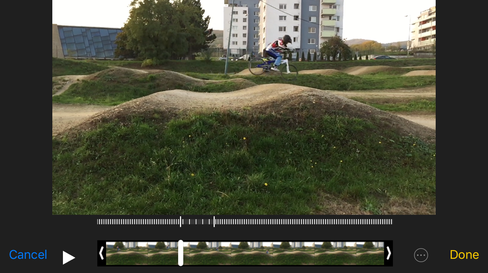

 echo "

Využitie foto a video techniky v tréningu cyklistiky (BMX)
==========================================================

 Cieľom práce je predstaviť niektoré postupy záznamu a analýzy športovej sekvencie
 a možné využitie týchto techník pri tréningu (najmä techniky) v BMX.

 V práci sú uvedené základne techniky snímania, spracovania, 
 a naznačené možné analýzy a možného využitia jednotlivých techník.

 Niektoré techniky sú známe z iných odvetví (kolektívne športy),
 ale pomerne málo alebo len čiastočne využívané v bežnom cyklistickom tréningu.

 Z dostupnosťou moderných technológií v mobilných zariadeniach
 sa však mnohé z nich stávajú cenovo dostupné a realizovateľné 
 aj v bežných individuálnych a klubových tréningoch.

Ide najme o techniky:

- foto sekvencie (Action Sequence Photo)
- spomalený video záznam
- anotovaný video záznam
- porovnávací video záznam alebo foto sekvencie

## Foto sekvencie (AS, Akčná sekvencia, sekvencia akcie, Action Sequence Photo)

Príklady:

Často využívaná technika v metodických materiáloch,
využíva sa tak kde video záznam nie je použiteľný (tlač),
alebo menej výpovedný ako fotografický záznam.

Umožňuje dodatočné anotovanie obrázkov a vyznačenie kľúčových aspektov techniky ako
trajektória pohybu, poloha tela a bicykla alebo aj časové aspekty (timing) ako miesto 
želaného odrazu, dopadu vzhľadom na prekážku.

Využitie:

V bežnej praxi sa stretneme skôr z využitím existujúcich sekvencií z 
externých zdrojov a ich následného využitia v tréningu na vysvetľovanie správnej techniky.
Anotovanie priamo pri vysvetľovaní témy môže byť veľmi efektívnym nástrojom, 
dopredu staticky anotované obrázky majú spravidla nižší efekt. Tu môže tréner 
využiť napríklad dostupný SW (MS Power Point, animácie) a postupne na obrázku zobrazovať
jednotlivé anotácie počas vysvetľovania, 
alebo úplne jednoducho priamo na papieri dokresľovať do obrázka
farebné značky.

Okrem tohoto metodického použitia sa veľmi často používa akčná sekvencia 
ako reklamný propagačný nástroj.

Realizácia:

Z foto alebo video záznamu.
V prípade foto záznamu, sa nemusí podariť (pri bežných fotoaparátoch) zachytiť vhodné polohy,
ale kvalita fotografií (ostrosť) je spravidla lepšia, v prípade vide záznamu je nutné z neho najskôr extrahovať fotografie, 
čo zase vyžaduje SW a skúsenosti. Oba procesy potom pokračujú výberom vhodných fotografií 
dobre reprezentujúcich danú techniku a ich spojení do jedného obrázka.
Tu ide spravidla o manuálny proces vyžadujúci znalosť práce z daným grafickým SW a značnú prax.
Úplná a použiteľná automatizácia takéhoto procesu nie je podľa mne dostupných informácií 
v súčasnosti dostupná v bežných SW nástrojoch.

Nasledujúce fotografie boli vytvorené z vide záznamu, každá samostatne

Na príklade je vidno, že zostaviť sekvenciu vhodnú na porovnanie, oboch jazdcov by vyžadovalo
ešte ďalšie úsilie a použitie tých istých obrázkov. V prípade video záznamu je to realizovateľné,
treba sekvenciu zostavovať na mieru na porovnávanie a vybrať rovnaké, signifikantné okamihy. 
 
V prípade fotografií a sekvencií pre porovnávanie je to už ťažšie. Vzhľadom na rozdielnu rýchlosť
pohybu jazdcov a možnosti fotoaparátu (počet snímkov za sekundu) sa 
sa šanca nasnímať identické okamihy ešte zhoršuje:

Sekvenčná fotografia dvoch jazdcov (súčasne jazdiacich), predstavuje najzložitejšiu
realizáciu a jej efekt pre porovnanie je tiež diskutabilný. Ide síce o efektný obrázok,
ale z pomerne sporným metodickým významom:

Trajektórie:
Pomerne použiteľné je zobrazenie trajektórie jazdca v zatáčke, 
ale aj tu videozáznam viacerých jazdcov je výstižnejší (kapitola Porovnávací video záznam).

Výhody:

- použiteľný v tlači
- minimálne nároky na prezentáciu (vytlačené na papieri)
- nenáročný spôsob dodatočnej anotácie (dokonca aj online na mobilnom zariadení)

Nevýhody:

- náročná realizácia (nie úplne automatický proces, treba grafický SW a skúsenosti)
- statický pohľad, chýbajúca dynamika pohybu

## Spomalený video záznam

Športové (akčné) kamery ale aj mnohé mobilné zariadenia podporujú nahrávanie videa v 
vysokých rozlíšeniach a počtoch snímkov za sekundu. Toto umožňuje vytvárať kvalitné spomalené
videozáznamy z spomalením až 6 krát bez straty kvality a dokonca aj 20 násobné spomalenia
z dostatočnou kvalitou pre metodické účely. 

Hlavnou výhodou mobilných zariadení je možnosť takto 
nasnímané video okamžite prehrať a zvoliť si spomalený úsek z nasnímaného videa 
prípadne spomalený výsek aj meniť.

Príklad použitia iPhone 6 a štandardného SW pre snímanie spomaleného videa (Slo-mo video, 120/240 fps)
a následného prehrania okamžite na telefóne zverencovi.
Príklad spomaleného vykonania odrazovej fázy:

a príklad spomaleného dopadu:

Takto jednoducho dokáže tréner zverencovi na ukážke videa okamžite 
hneď po vykonaní trénovanej techniky ukázať správne a chybné časti (
v tomto prípade chybný dopad). Zároveň tak jazdec má možnosť okamžitej 
vizuálnej spätnej väzby a nápravy pri ďalšom pokuse už na tom istom tréningu.

## Počítanie kadencie, počtu záberov medzi prekážkami
V BMX je dôležité, okrem iného, maximálne využite priestoru medzi prekážkami na zrýchlenie, 
teda aktívna šliapanie do pedálov. Pomocou spomaleného videa je možné zverencovi ukázať že:
začína šliapať príliš neskoro, spraví málo otáčok (kadencia), prípadne končí šliapanie príliš skoro pred prekážkou:

V praxi mu to ukazujeme na spomalenom zábere, tu ako ukážka fotografií:

 

Na príklade je jasné, že jazdec stihol len necelé 3 otáčky a začína šliapať neskoro za prvou prekážkou.
Iný jazdci v jeho kategórii robia medzi danými dvoma prekážkami 4-5 otáčok. 
Treba popracovať na zvýšení kadencie a začať šliapať skôr.

Na porovnanie 'treningová hra' teda rátanie a snaha o zvyšovanie šliapania medzi prekážkami, 
je našťastie medzi deťmi obľúbená, 
takže použitie videa na tento účel je skôr analytické ako motivačné, jazdec dokáže počítať otáčky aj sám. 
Video môže maximálne pomôcť v identifikácii problému 
(načasovanie, nízka kadencia, úplne nevhodné prevody, nedostatočná sila).

## Analýza kadencie počas časovky 

Náhodný experiment z využitím kamery umiestnenej na zadnej konštrukcii bicykla, videozáznam z časovky 6 ročného jazdca na domácej trati.

Originál video <https://www.youtube.com/watch?v=TG5ntk4okdg>, natočené pôvodne bez metodického úmyslu.

Video z označením časových intervalov (ukážka) <https://www.coachseye.com/v/ukNs>.

Následne z daného videa postupným manuálnym počítaním otáčok a označovaním intervalov, je pri znalosti trate možné zostaviť manuálne nasledovnú tabuľku (asi hodina práce).

Pri znalosti profilu trate a napárovaní  na profil trate je možné 
získať podstatne komplexnejšie údaje ako pri záberoch iba medzi dvoma prekážkami.

Analýza výsledkov:

Vybraný 6 ročný jazdec z 75 sekúnd na celej trati prešliape v pedáloch
2/3 času, čo je asi 50 sekúnd. Maximálna rpm ktorú dosiahne je 127, priemer je 95 rpm.

- pri štarte z rampy pomerne malé RPM (strach z prvej prekážky ?, problém statického štartu ?)
- nulová aktivita z prvej prekážky (z iných porovnaní jazdci dosiahnu 5-6 rotácií)
- maximálna frekvencia (prekvapivo 127 z prvej zátačky)
- .....

TODO: grafy

Bohužiaľ neexistuje porovnávacie video z iným jazdcom, ale
len na základe tohto videa už je možné identifikovať rozsah a aj priebeh typického zaťaženia, a možné tréningové zaťaženie na 
rozvoj rýchlosti a vytrvalosti.

Napr kondičný mimo trate:

- rýchlostný tréning na 1 minútu a meranie dosiahnutých rotácií 
- tréning 5 rotácií a 2 sekundy pauza a meranie výsledného času a vzdialenosti po 80 rotáciách.

Technický priamo na trati:

- zvýšenie počtu rotácií medzi prekážkami (pri zachovaní bezpečnej rýchlosti na zvládnutie ďalšej prekážky)
- ...

TODO: grafy

Vylepšenie a automatizácia postupu:

- farebné značky na trati
- korelácia údajov z cyclo-computerom merajúcim rýchlosť a prípadne GPS polohu
- použitie CV (Computer Vision) na analýzu videa z identifikáciou kadencie a značiek na trati (v prípade farebných markerov a nálepiek na podrážkach obuvi projekt na cca 10 dní)
- ....

Výhody:

- ľahká montáž a minimálne náklady v prípade, že vlastníte nejakú 'action kameru'
- Možnosť analýzy ex-post zo záznamu 
- Mo 

Nevýhody:

- nutnosť montáže/demontáže (10 min) na bicykel meranej osoby
- stiahnutie videa a prenos do SW z možnosťou merania času (10 min)
- vyhodnotenie (20-60 min podľa praxe a SW)

## Stopky

Ďalším možným využitím spomaleného videa je meranie času, bez použitia špeciálnej techniky.
Príkladom môže byť meranie od pádu rampy po prechod predným kolesom cez meranú líniu.

Zaujímavé na tejto technike je, že ak meriame tú istú sekvenciu viacnásobne počas tréningu
dokážeme vyhodnotiť vplyv techniky a reakcie na signál na výsledný čas v prvom úseku. 
Teda meriame čas ale máme k nemu aj vysvetľujúce video. 
Všetko už počas tréningu bez potreby dodatočného spracovania videa na počítači a techniky pre meranie času.

Len pre zaujímavosť a porovnanie 0.43 sekúnd na štarte v podaní detí:

Presnosť metódy samozrejme nenahrádza profesionálne meranie času, ale jej spojenie z video
analýzov za minimalne náklady a zložitosť je určite zaujímavé.

Analýza štartu
TODO: Poopravovat texty.

Typickým podkladom v BMX, pre analýzu techniky je napríklad štart.
Nahrávanie štartov v spomalenej podobe, je vhodným príkladom vysvetlenia techniky (viď DVD...)
a podkladom pre analýzu profesionálnym cauchom, napr. <http://bmxtraining.com/shop/gate-start-analysis-with-coach-greg-romero/>.

## Anotovaný (komentovaný video záznam)

V praxi túto techniku najčastejšie poznáme z prestávok zápasov ľadového hokeja,
kedy hokejový znalec kreslí na obrazovke krúžky a šípky okolo hokejistov a puku a vysvetľuje, čo sa počas hry udialo
zle alebo dobre, kam smerovala prihrávka a kam ozaj mala smerovať, ktorý hráč stál kde a v akej dobrej zlej pozícii a podobne.

Zariadenie umožňujúce takéto zobrazenie sa nazýva Telestrátor.
Telestrator je zariadenie ktoré umožňuje operátorovi kresliť voľnou rukou ponad video alebo statické obrázky. 
<https://en.wikipedia.org/wiki/Telestrator>.

Bežne sa používa pre:

- kolektívne hry (hokej, futbal, americký futbal)
- individuálne športy (baseball, golf)
- atletiku, gymnastiku

V cyklistike a v BMX je jeho použitie menej známe.

V tradičnom ponímaní ide o zariadenie pomerne veľkého rozmeru a vysokej ceny, založené na klasickom PC a 
monitore (aj keď v prenosnom balení).

Našťastie rozvoj internet a mobilných technológií dnes sprístupňuje túto funkcionalitu na 
bežných mobilných telefónoch za minimálnu cenu, alebo na internetových stránkach ako online 
služby použiteľné z bežného PC a za podstatne nižšie ceny ako tradičné zariadenia.

Nahrávanie videa a následná okamžitá analýza na mobilnom zariadení:

Prehľad funkcionality:

Umožňuje z pôvodného videa vytvoriť nové video z rôznou rýchlosťou, zastavovaním, prevíjaním dopredu dozadu,
zaznamenať k nemu  hlasové komentáre a grafické, značky vo video zázname.

Použitie, napríklad na analýzu doskoku a vyznačenie nedokonalej techniky:

Obrázok 1: vyznačenie miesta dopadu predného kolesa a problémová výška zadného kolesa.
Obrázok 2: Modrou označená dĺžka jazdy čisto po prednom kolese a farebne označený dopad predného a zadného kolesa.
Obrázok 3: To isté, ale s koncovou pozíciou jazdca

Samozrejme hlavnou prednosťou je že anotovaním zase vznikne video,
kde jednotlivé značky pribúdajú odbúdajú tak ako to tréner vyznačil počas nahrávania,
prezentácia videa je však v tomto texte problémová, takže je uvedený len obrázok.

## Porovnávací video záznam

Porovnávanie jedného jazdca a jednej techniky tej istej prekážke:

Nahrávanie jazdca počas nácviku danej techniky (prejazd po zadnom kolese, manual)
na tej istej prekážke môže poukazovať na nekonzistentné prevedenie. 
Napriek možným úspešným pokusom, ktoré jazdec vníma ako pozitívne zvládnutie techniky, 
videozáznam zachytí aj menej úspešné pokusy.
Príklad ukazuje dve nedokonalé prevedenia, rozdiely v náklone 
a neoptimálnom mieste dopadu predného kolesa.

Tréning by mal byť v takom prípade zameraný na konzistentnejšie zvládnutie, 
napr. 7 dokonalých prevedení z 10 na danej prekážke aby sa upevnili návyky a časovanie
a až potom pokračovať aplikovaním v inej rýchlosti a potom na inej prekážke.

Zároveň možno vysvetliť na jednotlivých úspešných záznamoch porovnaním z neúspešnými
kde bola chyba v polohe tela, načasovaní, vystretí nôh a rúk a podobne.

Takáto vizuálna spätná väzba môže urýchliť učenie, prípadne napomôcť motivácii.
Uchovanie záznamov zo správnym aj nesprávnym prevedením môže potom poslúžiť
ako dodatočný metodický materiál pre ďalšie tréningy, 
ale aj zaujímavý motivačný materiál: \"pozri ráno si to jazdil ešte takto, 
teraz je to oveľa lepšie, vidíš že sa to dokážeš naučiť za jeden deň, super \".

Príklady videí z konkrétneho tréningu:

<https://www.youtube.com/watch?v=Lp34ug6n9bM>
<https://www.youtube.com/watch?v=a9rVfpKtoV0>

Pred tréningom jazdci nedokázali prekonať danú prekážku po zadnom kolese.
Po každom druhom pokuse pozerali video a diskutovali sa chyby,
pokusy na prekážke boli striedané z prípravnými cvičeniami a pokusmi mimo prekážku.
Na konci hodinového tréningu už mali prevahu úspešných pokusov. 

Porovnávanie rôznych jazdcov a jednej techniky tej istej prekážke:

Rovnako môžeme použiť porovnávanie dvoch jazdcov, poukázať na rozdiely v technike
a poskytnúť vizuálny návod na ich odstránenie. 

<https://www.youtube.com/watch?v=DmGIgXQe_AE>

Rovnako ako v jednotlivých videách aj pri porovnávaniach je možné vkladať grafické prvky
zastavovať, spomaľovať video a podobne.

Ďalším druhom porovnávacieho videa je rovnako filmovanie viacerých jazdcov na jednej 
prekážke na trati ale bez špeciálnych úprav, napríklad prejazd zatáčkou je na takéto porovnanie
vhodný. Jazdci si môžu porovnať štýl jazdy, trajektórie, náklony, pedálovanie a rýchlosti prejazdu.
Toto je najjednoduchší spôsob nevyžadujúci nijaké špeciálne SW and HW vybavenie, postačuje kamera 
a a prípadne prehrávač z možnosťou stop alebo spomaleného záznamu.

<https://www.youtube.com/watch?v=GLV-hCA7u64>

## Kombinované a improvizované techniky

- Premietanie spomaleného videa na tabuľu a kreslenie trajektórie fixkou....
TODO: technika, význam

- Screenshot z videa priamo na telefóne..... editácia v programe a send my email...

## Význam jednotlivých techník

- ukázať prvotne dobrú techniku
- ukázať prvotne zlú techniku
- porovnať prevedenie z dobrou technikou a vyznačiť rozdiely
- ukázať vplyv techniky na rýchlosť (jump, pump, vs. manual) toho istého úseku trate

## Sumarizácia
Nasledovná tabuľka porovnáva vhodnosť jednotlivých techník a ich náročnosť na
realizáciu a demonštrácie na rôzne účely:

TODO:

## Použitá technika

- Canon EOS 500D + bežný objektív
- iSaw 3 Extreme - kamera
- iPhone 6
- iPad 3
- 

## Literatúra

- <http://www.leelikesbikes.com/book-pro-bmx-skills>
- <https://github.com/ainthek/video-tools>
- TODO: linka na ASequence bakalarky čo som našiel

# Web Sites/Companies of Video Analyses and Coaching
- <http://www.telestrator.com>
- <http://www.hudl.com/sports>
- <http://www.powerchalk.com>

- <http://bmxtraining.com>
"

