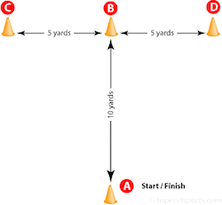
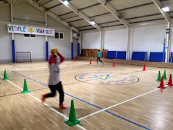
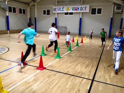

# Hospitačný záznam tréningovej jednotky

- Špecializácie (šport):	Cyklistika	
- Telovýchovná jednota (oddiel, klub a pod.):	BMX Klub Rača
- Miesto: Gymnáziu školských bratov na Čachtickej ul. v Rači 					
- Dátum a čas: 14.1.2016 19:00-20:15
- Počet trénujúcich (pohlavie):	13, 3 dievčatá, 10 chlapcov, od 5 do 14 rokov	
- Tréner/ Inštruktor/ Cvičiteľ:	Mikuláš Rapčan, Martin Marko		
- Pozorovateľ:	Martin Marko				
- Hlavný cieľ tréningovej jednotky:	úvodný kondičný tréning počas zimného obdobia, v nových priestoroch

## Obsah:
 
### Rozcvička:

- rozcvička (vedie pomocný trérner), rozbehanie v kruhu, beh dozadu, poskoky, beh do osmičky  - 3min
- dynamický stretching (vedie pomocný trérner)- podobný ako sa prevádza na trati pred tréningov - 5 min 

Minimálne prestoje, počas rozvičky hlavný tréner pripravoval pomôcky a rozcvičoval sa tiež.

### Agility test a meranie: 

T-test: z modifikovanými vzdialenosťami

 

- vysvetlenie a predvedenie testu, názorne 
- vykonanie testu, každý 3 kolá a zaznamenanie výsledkov pre porovnanie po skončení kondičnej prípravy.  

Minimálne prestoje, počas testu hlavný tréner pripravoval pomôcky  a staval dráhu na ďalší tréning.

Výkonnosť v jednej kategórii bola silne rozdielna. 
Taktiež niektorý opakovali test kvôli neschopnosti si zapamätať dráhu.

Išlo skôr o hravú súťaživosť a pokračovanie rozohriatia, 
test budeme nabudúce opakovať, keď už ho poznajú.

Trvanie: 15 min (individuálne asi 30sek)
Intenzita: vysoká

### Hádzanie malým medicinbalom

- predvedenie techniky trénerom
- vysoké rozdiely v výkonnosti 

Cieľom je predvedenie techniky, na budúcich tréningoch bude aj meranie

Trvanie: asi 5-10 min
Intenzita: nízka, 2 série po 3 hody

Prestoje, minimálne, kto docvičil tak bola vysvetlená technika trojskoku znožmo z miesta,
deti čo už dohádzali tak skákali (iba starší).

### Trojskok znožmo z miesta (3 hop jump test)

Demonštrácia techniky, príprava na meraný skok v budúcom tréningu.
počas hádzania ako vyplnenie času pre starších. Cieľom bolo vysvetliť pravidlá testovacieho 'protokolu' na budúci tréningom keď sa už bude merať. Pozri:
<http://www.topendsports.com/testing/tests/2-hop-jump.htm>

### Slalomový štafetový beh - cca 10 min

Deti v dvoch skupinách, delené podľa výšky.
Beh pomedzi kužele (slalom) tam a nazad na 18 metrov (dĺžka voeljb. ihriska).

Dva teamy bežia naraz. 
Prvé kolo, beh jedným smerom aj z medicinbalom v ruke.
Druhé kolo, beh z medicinbalom v ruke oboma smermi, 
jedným smerom vo vystretých rukách nad hlavou. 

Intenzita: stredná

### Prekážkový beh - 10 min

2 série po 3 kola starší, 2 kolá mladší
preskoky plynulým spôsobom z nohu na nohu (starší), alebo z medzikrokom (mladší) a obeh 
okolo medicinbalov pri návrate (cca 18 metrov skoky a 22 m beh)

Intenzita: vysoká
Pomôcky: kužele  z  tyčami

### 'Tabata' - 6 min

Experiment na odhadnutie pre budúce tréningy

- 1min - Jumping Jacks
- 1min - Plank
- 1min - Running Knee High
- 1min - L- plank
- 1min - Boxing
- 1min - R- plank

Nik z cvičencov nedokončil celú 1min v dobrom prevedení.
Nabudúce ideme po 20sec intervaloch.

Intenzita: veľmi vysoká

### Prekážkové skoky - 10 min

Preskoky cez 8 kužeľov z tyčami, cca 9 metrov.

Priamo znožmo tam a nazad
z vytáčaním doľava doprava, tam a nazad, celkovo 4x8 skokov.

### Záverečné uvoľnenie 10 min

Strečing, prevažne nôh.
Tlačenie do steny, iné cviky.

